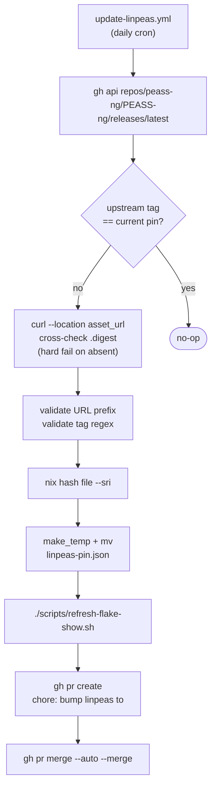
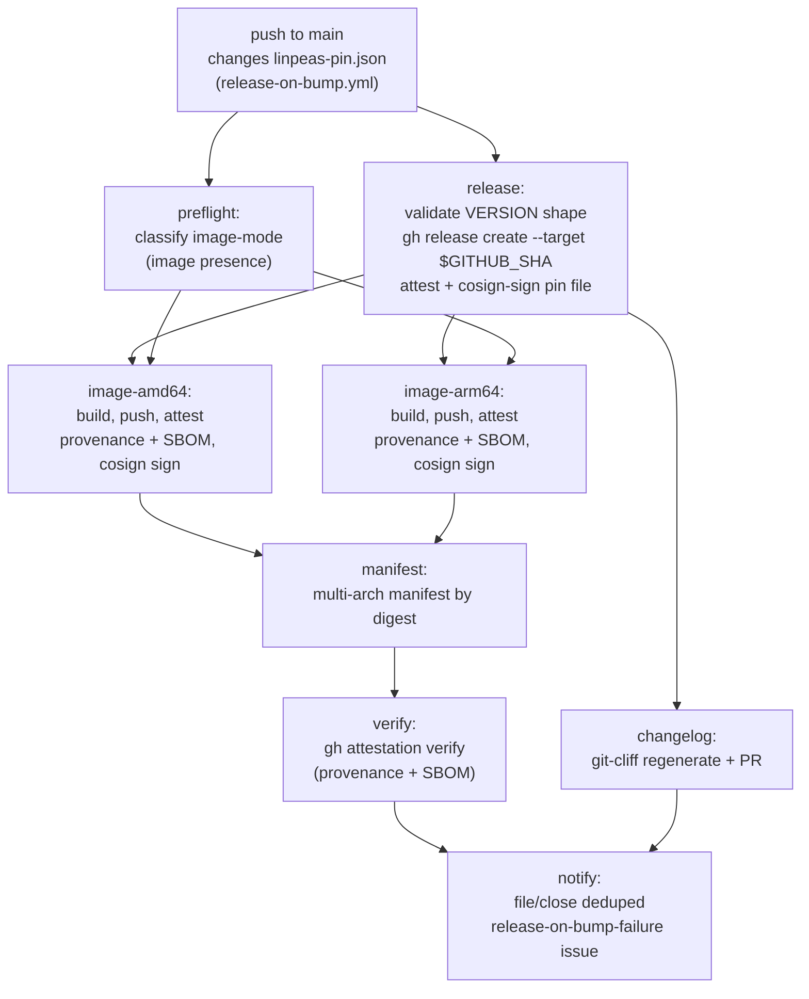
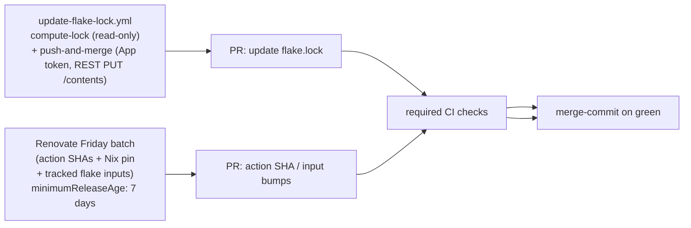

# Auto-update architecture

Three independent automations keep the pin current and the release artifacts in sync.

## Daily linpeas pin bump

## Release on bump

`notify` runs on `always()` and reads the result of every job above it,
so it is the observability path for this pipeline rather than a step in
it.

## Weekly dependency upkeep

No third-party flake-lock action is used: such actions take the write credential as a `with: token:` input, which would put it inside an externally-controlled action boundary. The split-job design instead confines Nix evaluation to a `contents: read` job; the `push-and-merge` job authenticates to the GitHub API as the `linpeas-flake-bumper` App via a short-lived installation token (`actions/create-github-app-token`), then commits files via REST `PUT /contents`. No `git push`, no PAT in `.git/config`. REST commits authenticated by an App installation token are auto-signed by GitHub's web-flow GPG key, so the bump branch satisfies `required_signatures` on `main`.

## Flake-input staleness watchdog

Both mechanisms above refresh inputs, and neither announces having stopped.
A disabled workflow, a broken trigger, or a Renovate manager whose matcher no
longer matches leaves every input frozen while every check stays green. Both
halves of that have already happened in this repo: a login-shape change
silently disabled `renovate-flake-lock-refresh.yml` for its entire lifetime,
and Renovate sat in Mend silent mode long enough for `pre-commit-hooks` to
reach 102 days without anything saying so.

`scripts/check-flake-lock-staleness.sh`, run daily by
`flake-lock-staleness-check.yml`, watches the freeze rather than any single
mechanism: it fails when a top-level input's `locked.lastModified` is older
than the bound declared for that input.

It is a scheduled issue-filer, not a required check. A gate keyed on
wall-clock age turns every unrelated PR red the moment a cron runs late, which
charges contributors for infrastructure lateness.

`locked.lastModified` is an upstream commit time, not a record of when this
repo last checked, which is what makes the bounds uneven rather than
arbitrary. For a high-churn input, upstream moves far faster than the bound,
so an old lock can only mean nobody refreshed it. For a low-churn input, an
old lock most likely means upstream is quiet, and a tight bound would report
that as drift. Each input therefore gets the bound its upstream churn can
support:

| Tier | Bound    | Inputs                                           | Why                                                                                                                             |
| ---- | -------- | ------------------------------------------------ | ------------------------------------------------------------------------------------------------------------------------------- |
| Fast | 14 days  | `nixpkgs`, `nixpkgs-unstable`                    | Branch-tracked against an upstream committing at least daily. Two missed weekly cron cycles is already past anything healthy.   |
| Slow | 120 days | `flake-parts`, `treefmt-nix`, `pre-commit-hooks` | Upstream commits in bursts. Loose enough that ordinary quiet never fires, tight enough that a stopped mechanism still surfaces. |

Scope is the top-level inputs only. A transitive node's rev is chosen by its
parent's pin rather than by anything this repo runs, so its age reports on
somebody else's release cadence — `gitignore` is years old because
`git-hooks.nix` pins it there, and no mechanism here is failing. Including it
would mean a permanently red check nobody can act on.

An input present in `flake.lock` that the bound table does not name is an
operational error, not a pass: a threshold table rots when an input is added
and not registered, and the silent-pass version of that rot is a new input
nobody is watching.

## Dependency-PR merge policy

Every class of dependency bump merges unattended once the required
check set is green. There is no reviewer gate on any class, and no
per-PR lever to introduce one: Renovate re-arms `platformAutomerge` on
its next run over the repo, so `gh pr merge --disable-auto` does not
hold. A bump that must not land is held by making a check fail, or by
closing the PR and letting the dependency-dashboard entry re-propose
it.

What stands between a bump and `main`:

| Gate                              | Applies to                                                    | What it catches                                                                                                              |
| --------------------------------- | ------------------------------------------------------------- | ---------------------------------------------------------------------------------------------------------------------------- |
| `minimumReleaseAge: 7 days`       | every Renovate PR                                             | a release yanked or patched shortly after publication                                                                        |
| SHA / digest pinning              | GitHub Actions, octoscan, `cachix/git-hooks.nix`, SchemaStore | a mutable tag repointed under the pin                                                                                        |
| `check-pin-digest-provenance.sh`  | GitHub Actions, octoscan                                      | a digest-only repoint where the version label did not move                                                                   |
| required check set                | every PR                                                      | build, harness, lint, and attestation failures reproducible at PR time                                                       |
| `renovate-flake-lock-refresh.yml` | `nixpkgs`, `pre-commit-hooks`                                 | a `flake.nix` bump whose lockfile refresh writes outside the paths it may commit — the job fails closed and the PR stays red |

The gate this policy deliberately does not have is a human reading the
diff. That trade is sharpest for the `nixpkgs` stable-branch bump,
where part of the fallout — formatter rewrites, new linter rules —
surfaces on a later cron run or contributor PR rather than on the
bump's own checks. A green check set is therefore not proof that a
stable-branch bump is inert; it is proof that nothing reproducible at
PR time is broken. Recovery for the rest is a revert, and the fallout
classes are tabulated in
[flake-input-bumps.md](flake-input-bumps.md).

## Where this site fits

The Pages workflow runs:

- On every push to `main` (catches docs and code changes).
- On every PR to `main` — `build` only; `deploy` and `notify` are gated off
    for pull requests, so a PR renders the site without publishing it.
- On every release (catches release-on-bump pin landings).
- Last slot in the daily window, after `update-linpeas` and `stale-pin-check`, so the dashboard reads a settled state. See [CI — cron schedule](ci.md#cron-schedule).
- On manual `workflow_dispatch`.

The Pages site is **not** in the `protect-main` ruleset's required check set; a Pages failure must not block pin bumps. See [CI](ci.md).

## Pin-diff isolation

Only `scripts/bump-linpeas.sh` may mutate `linpeas-pin.json`. Any
commit landing on `main` that changes the SRI hash, pin URL, or pin
version must isolate that change to `linpeas-pin.json`. The only automatic trigger
for `release-on-bump.yml` is `push.paths: [linpeas-pin.json]` (a manual
`workflow_dispatch` recovery and backfill path also exists). A pin change
that bundles in unrelated files is what this rule forbids — the trigger may
or may not fire depending on the merge-commit diff shape — and a pin change
that arrives via a different script breaks the same contract.

Enforced by `scripts/check-pin-diff-isolated.sh` via the
`lint-doc-invariants` CI job (member check `pin-diff-isolated`) + pre-commit hook. Lint asserts
exactly one writer (`scripts/bump-linpeas.sh`) under `scripts/`.

## nix/linpeas.nix pin invariants

`pin.version` must match `[0-9]{8}-[0-9a-f]{7,40}`. `pin.url` must start with
`https://github.com/peass-ng/PEASS-ng/releases/download/`. `pin.version` must
also be the release-tag path segment of `pin.url`, so a hand-edited pin
cannot declare one version while fetching a different release's artifact.
Flake-eval-time asserts because `pin.version` interpolates into derivation
names, docker tags, OCI labels.

Upstream peass-ng versioning-scheme change: update the regex carefully and
keep a shape check. Every file that has to move together is listed under
[Canonical pin shape](#canonical-pin-shape).

## Canonical pin shape

Upstream tags the linpeas release as `YYYYMMDD-<hex>`, and the repo matches
that shape with one regex, `^[0-9]{8}-[0-9a-f]{7,40}$`. The regex has no
single home: a Nix assert, a git-cliff config key, several scripts and
several workflow steps each carry their own copy, because workflow YAML
cannot source a shell library and a Nix assert cannot read one either. The
duplication is therefore permanent, and the risk it carries is that a
versioning-scheme migration updates some copies and leaves others behind.

The list below is derived from the tree on every run, so it names the copies
that exist rather than the copies someone remembered. Regenerate it with
`scripts/refresh-pin-parity.sh`; do not hand-edit between the markers.

<!-- BEGIN pin-parity -->

Enforcement and configuration:

- `.github/actions/notify-workflow-result/action.yml`
- `.github/workflows/release-on-bump.yml`
- `.github/workflows/stale-pin-check.yml`
- `.github/workflows/update-linpeas.yml`
- `cliff.toml`
- `nix/linpeas.nix`
- `scripts/bump-linpeas.sh`
- `scripts/check-cliff-tag-pattern.sh`
- `scripts/check-tag-protection.sh`
- `scripts/gen-dashboard-data.sh`
- `scripts/refresh-pin-parity.sh`

Documentation:

- `docs/architecture/auto-update.md`
- `docs/architecture/ci.md`
- `docs/development/changelog.md`
- `docs/invariant-index.md`
- `docs/security/repo-config.md`
- `docs/security/settings-posture.md`
- `docs/security/trust-model.md`

Test fixtures and harnesses under `tests/` carry the shape too and are
excluded from these lists; a scheme migration updates them alongside the
check each one drives.

<!-- END pin-parity -->

## Release VERSION shape validation

`release-on-bump.yml` rejects any tag outside the canonical pin shape
`^[0-9]{8}-[0-9a-f]{7,40}$` (`YYYYMMDD-<hex>`) before calling
`gh release create`.

## Linpeas-pin release-trigger

Any change to `linpeas-pin.json` that lands on `main` MUST cause a
new release to be cut by `release-on-bump.yml`. The next
`verify-latest-release` cron run after the change asserts that the
release-asset copy of `linpeas-pin.json` matches the in-tree copy
(attestation verification). A pin change that lands without firing
the release pipeline leaves `main` in a state where the in-tree pin
diverges from the latest-release-asset pin; the verify cron would
fail on its next weekly run.

Paired with the `pin-diff-isolated` invariant: the only mutator
(`bump-linpeas.sh`) writes only `linpeas-pin.json`, so any pin
change naturally satisfies the `release-on-bump.yml`
`paths: [linpeas-pin.json]` trigger.
