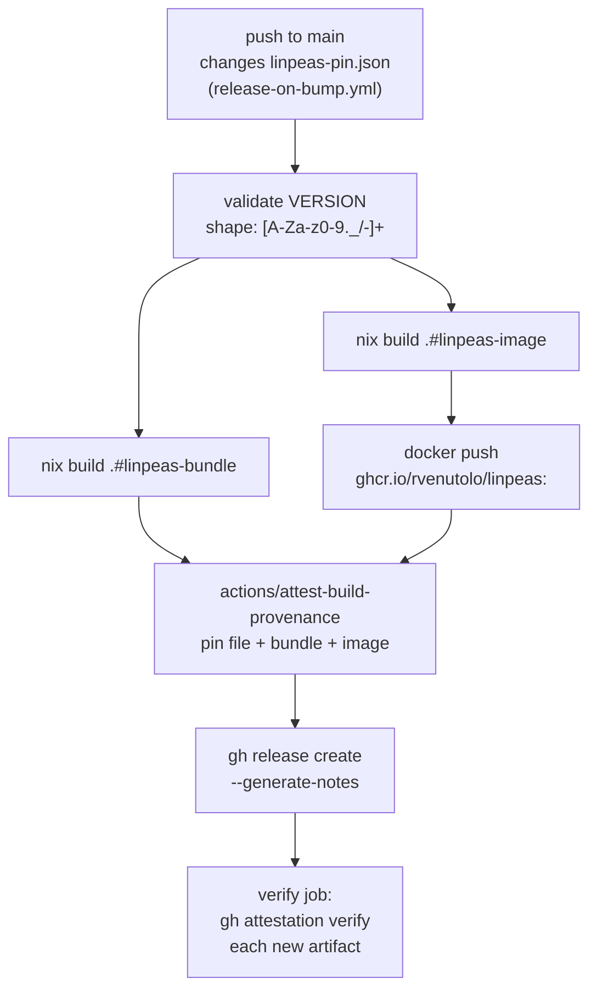
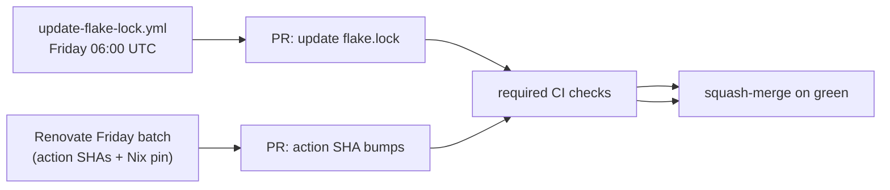

# Auto-update architecture

Three independent automations keep the pin current and the release artifacts in sync.

## Daily linpeas pin bump

## Release on bump

## Weekly dependency upkeep

## Where this site fits

The Pages workflow runs:

- On every push to `main` (catches docs and code changes).
- On every release (catches release-on-bump pin landings).
- Daily at 10:00 UTC — one hour after the pin-bump cron, so the dashboard reflects the day's bump.
- On manual `workflow_dispatch`.

The Pages site is **not** in the branch-protection required check set; a Pages failure must not block pin bumps. See [CI](ci.md).
