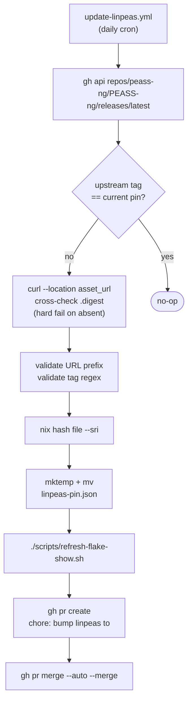
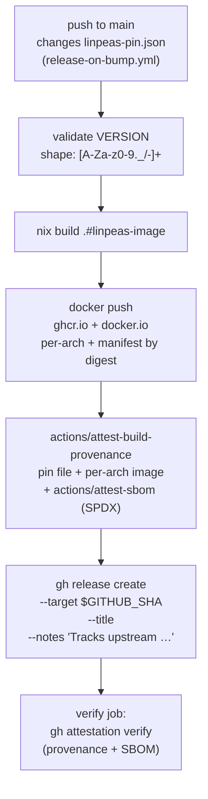
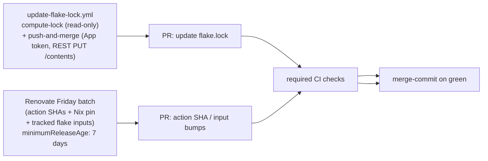

# Auto-update architecture

Three independent automations keep the pin current and the release artifacts in sync.

## Daily linpeas pin bump

## Release on bump

## Weekly dependency upkeep

The third-party `DeterminateSystems/update-flake-lock` action was removed: it required `BUMP_PAT` as a `with: token:` input, putting the PAT inside an externally-controlled action boundary. The split-job design confines Nix evaluation to a `contents: read` job; the `push-and-merge` job authenticates to the GitHub API as the `linpeas-flake-bumper` App via a short-lived installation token (`actions/create-github-app-token`), then commits files via REST `PUT /contents`. No `git push`, no PAT in `.git/config`. REST commits authenticated by an App installation token are auto-signed by GitHub's web-flow GPG key, so the bump branch satisfies `required_signatures` on `main`.

## Where this site fits

The Pages workflow runs:

- On every push to `main` (catches docs and code changes).
- On every release (catches release-on-bump pin landings).
- Last slot in the daily window, after `update-linpeas` and `stale-pin-check`, so the dashboard reads a settled state. See [CI — cron schedule](ci.md#cron-schedule).
- On manual `workflow_dispatch`.

The Pages site is **not** in the `protect-main` ruleset's required check set; a Pages failure must not block pin bumps. See [CI](ci.md).

## Pin-diff isolation

Only `scripts/bump-linpeas.sh` may mutate `linpeas-pin.json`. Any
commit landing on `main` that changes the SRI hash, pin URL, or pin
version must isolate that change to `linpeas-pin.json`. Sole trigger
for `release-on-bump.yml` is `push.paths: [linpeas-pin.json]`; a pin
change that bundles in unrelated files is fine, but a pin change
that arrives via a different script breaks the trigger-contract
assumption.

Enforced by `scripts/check-pin-diff-isolated.sh` via the
`lint-doc-invariants` CI job (member check `pin-diff-isolated`) + pre-commit hook. Lint asserts
exactly one writer (`scripts/bump-linpeas.sh`) under `scripts/`.

## nix/pin.nix invariants

`pin.version` must match `[0-9]{8}-[0-9a-f]{7,40}`. `pin.url` must start with
`https://github.com/peass-ng/PEASS-ng/releases/download/`. Flake-eval-time
asserts because `pin.version` interpolates into derivation names, docker
tags, OCI labels.

Upstream peass-ng versioning-scheme change: update regex carefully, keep some
shape check.

## Release VERSION shape validation

`release-on-bump.yml` rejects any tag outside `[A-Za-z0-9._/-]+` before
calling `gh release create`.

## Linpeas-pin release-trigger

Any change to `linpeas-pin.json` that lands on `main` MUST cause a
new release to be cut by `release-on-bump.yml`. The next
`verify-latest-release` cron run after the change asserts that the
release-asset copy of `linpeas-pin.json` matches the in-tree copy
(attestation verification). A pin change that lands without firing
the release pipeline leaves `main` in a state where the in-tree pin
diverges from the latest-release-asset pin; the verify cron would
fail the next morning.

Paired with the `pin-diff-isolated` invariant: the only mutator
(`bump-linpeas.sh`) writes only `linpeas-pin.json`, so any pin
change naturally satisfies the `release-on-bump.yml`
`paths: [linpeas-pin.json]` trigger.
