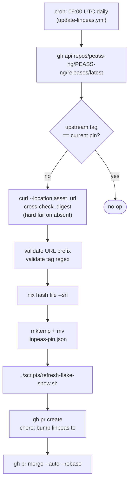
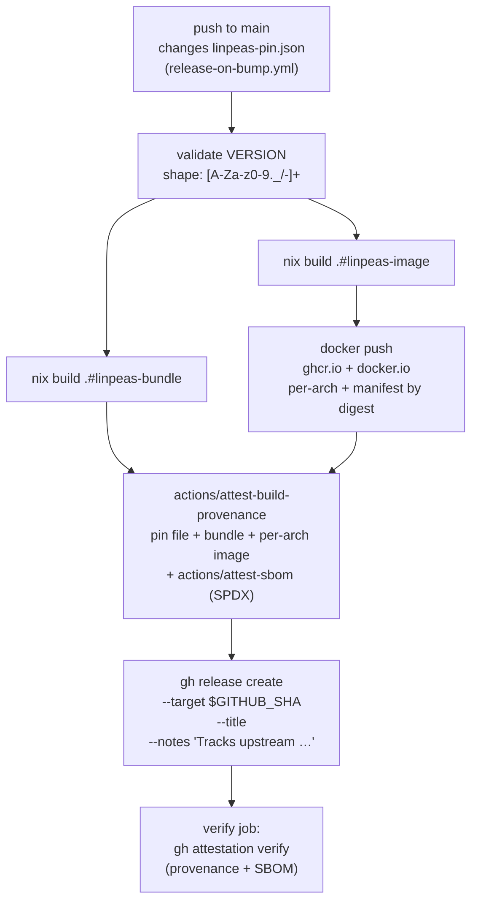
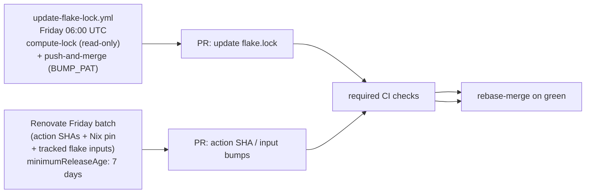

# Auto-update architecture

Three independent automations keep the pin current and the release artifacts in sync.

## Daily linpeas pin bump

## Release on bump

## Weekly dependency upkeep

The third-party `DeterminateSystems/update-flake-lock` action was removed: it required `BUMP_PAT` as a `with: token:` input, putting the PAT inside an externally-controlled action boundary. The split-job design now confines Nix evaluation to a `contents: read` job and isolates the PAT to a GitHub-owned-action job that pushes via `git -c http.extraheader=...` (never writing to `.git/config`).

## Where this site fits

The Pages workflow runs:

- On every push to `main` (catches docs and code changes).
- On every release (catches release-on-bump pin landings).
- Daily at 14:00 UTC — after the bump-related crons (09:00 `update-linpeas`, 10:30 `stale-pin-check`, 12:00 `verify-latest-release`), so the dashboard reads a settled state. See [CI — cron schedule](ci.md#cron-schedule).
- On manual `workflow_dispatch`.

The Pages site is **not** in the `protect-main` ruleset's required check set; a Pages failure must not block pin bumps. See [CI](ci.md).
