# CI dependency graph

Visualization of `jobs.*.needs` relationships in
[`.github/workflows/ci.yml`](https://github.com/rvenutolo/linPEAS-flake/blob/main/.github/workflows/ci.yml).
Nodes are colored by the category mapping in
[`docs/_data/ci-check-categories.yml`](../_data/ci-check-categories.yml);
uncategorized auxiliary jobs render gray. Regenerated by
`scripts/refresh-ci-dag.sh`; the `ci-dag-fresh` pre-commit hook and the
`refresh-ci-dag-test` CI job gate drift.

```mermaid
flowchart TD
  classDef build fill:#c8e6c9,stroke:#2e7d32
  classDef security fill:#ffe0b2,stroke:#e65100
  classDef doc fill:#bbdefb,stroke:#1565c0
  classDef commits fill:#e1bee7,stroke:#6a1b9a
  classDef aux fill:#eeeeee,stroke:#616161

  allowed-actions-api-harness:::aux
  build-linpeas:::build
  build-linpeas-arm64:::build
  build-linpeas-matrix:::aux
  check-doc-anchors:::doc
  check-jsonschema:::security
  check-orphan-invariants:::doc
  checkout-persist-credentials:::security
  ci-job-in-summary:::security
  cliff-tag-pattern:::security
  commitlint:::commits
  cosign-identity-pinned:::security
  dashboard-data-tests:::security
  editorconfig:::doc
  flake-check:::build
  flake-check-matrix:::aux
  fork-guard-release:::security
  gh-api-version-header:::aux
  gh-attestation-repo:::security
  harden-runner-first:::security
  image-cve-scan-grype:::aux
  image-cve-scan-grype-notify-finding:::aux
  image-cve-scan-grype-notify-infra:::aux
  image-cve-scan-trivy:::aux
  image-cve-scan-trivy-notify-finding:::aux
  image-cve-scan-trivy-notify-infra:::aux
  image-smoke:::build
  image-smoke-arm64:::build
  job-timeout-minutes:::security
  markdownlint:::doc
  min-permissions:::security
  nix-run-pinned:::security
  pin-diff-isolated:::security
  pr-workflows-no-secrets:::security
  pre-commit-hooks-sha-parity:::security
  protect-main-drift-check:::security
  pull-request-target-absent:::security
  ratchet-pin-audit-harness:::security
  refresh-ci-dag-test:::aux
  refresh-ci-summary-test:::aux
  refresh-enforcement-matrix-test:::aux
  refresh-just-recipes-test:::aux
  refresh-precommit-table-test:::aux
  refresh-scripts-reference-test:::aux
  refresh-treefmt-config-test:::aux
  renovate-config-validator:::security
  renovate-invariants:::security
  required-checks-no-paths:::security
  run-block-strict:::security
  script-has-test:::security
  script-shebang-pipefail:::security
  settings-posture-harness:::aux
  setup-nix-required:::security
  smoke-test:::build
  smoke-test-arm64:::build
  tag-protection-drift-check:::security
  typos:::doc
  upload-artifact-strict:::security
  uses-sha-pinned:::security
  workflow-concurrency:::security
  workflow-on-branches:::security

  image-cve-scan-grype --> image-cve-scan-grype-notify-finding
  image-cve-scan-grype --> image-cve-scan-grype-notify-infra
  image-cve-scan-trivy --> image-cve-scan-trivy-notify-finding
  image-cve-scan-trivy --> image-cve-scan-trivy-notify-infra
  build-linpeas --> smoke-test
  build-linpeas-arm64 --> smoke-test-arm64
```

<!-- BEGIN ci-dag -->

<!-- END ci-dag -->
