# CI dependency graph

Visualization of `jobs.*.needs` relationships in
[`.github/workflows/ci.yml`](https://github.com/rvenutolo/linPEAS-flake/blob/main/.github/workflows/ci.yml).
Nodes are colored by the category mapping in
[`docs/_data/ci-check-categories.yml`](../_data/ci-check-categories.yml);
uncategorized auxiliary jobs render gray. Regenerated by
`scripts/refresh-ci-dag.sh`; the `ci-dag-fresh` pre-commit hook gates drift
in the committed block, and the `doc-freshness` CI job asserts the generator
still reproduces it.

```mermaid
flowchart TD
  classDef build fill:#c8e6c9,stroke:#2e7d32
  classDef security fill:#ffe0b2,stroke:#e65100
  classDef doc fill:#bbdefb,stroke:#1565c0
  classDef commits fill:#e1bee7,stroke:#6a1b9a
  classDef aux fill:#eeeeee,stroke:#616161

  build-linpeas:::build
  build-linpeas-arm64:::build
  changelog-links:::doc
  cliff-tag-pattern:::security
  commitlint:::commits
  dashboard-data-tests:::security
  doc-freshness:::doc
  editorconfig:::doc
  flake-check:::build
  harness-group:::security
  image-smoke:::build
  image-smoke-arm64:::build
  lint-doc-invariants:::security
  lint-script-hygiene:::security
  lint-workflow-security:::security
  markdownlint:::doc
  pr-workflows-no-secrets:::security
  protect-main-drift-check:::security
  renovate-invariants:::security
  required-checks-no-paths:::security
  setup-nix-required:::security
  smoke-test:::build
  smoke-test-arm64:::build
  tag-protection-drift-check:::security
  typos:::doc

  build-linpeas --> smoke-test
  build-linpeas-arm64 --> smoke-test-arm64
```

<!-- BEGIN ci-dag -->

<!-- END ci-dag -->
