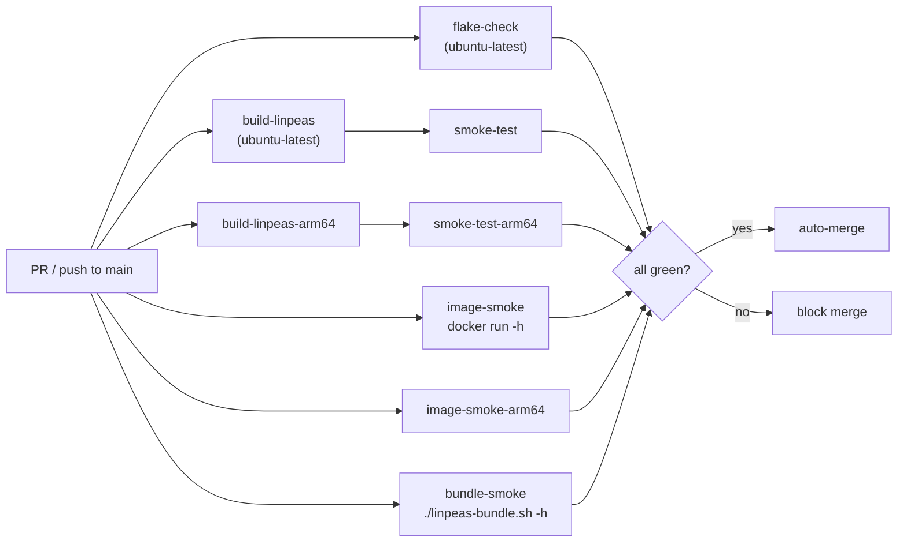

# CI architecture

Every push to `main` and every PR runs a required set of jobs that gate auto-merge. A separate non-blocking coverage matrix runs informational checks.

## Required jobs



## Required check list

The canonical list — mirroring the `protect-main` branch ruleset — lives
in [`docs/security/required-checks.md`](../security/required-checks.md).
The table below summarizes the functional and invariant gates; consult the
canonical doc as source of truth.

Functional gates:

| Job                   | Runner             | What it tests                                                                                                  |
| --------------------- | ------------------ | -------------------------------------------------------------------------------------------------------------- |
| `flake-check`         | `ubuntu-latest`    | `nix flake check` — eval, treefmt, deadnix, statix, actionlint, yamllint, shellcheck, README-staleness, schema |
| `build-linpeas`       | `ubuntu-latest`    | `nix build .#linpeas` — fetches upstream `linpeas.sh`, verifies SRI hash, builds the derivation                |
| `smoke-test`          | `ubuntu-latest`    | `./result/bin/linpeas -h` exits 0                                                                              |
| `build-linpeas-arm64` | `ubuntu-24.04-arm` | aarch64 build of `linpeas`                                                                                     |
| `smoke-test-arm64`    | `ubuntu-24.04-arm` | aarch64 `-h` smoke                                                                                             |
| `image-smoke`         | `ubuntu-latest`    | builds OCI image, `docker load`, `docker run --rm  -h` exits 0                                            |
| `image-smoke-arm64`   | `ubuntu-24.04-arm` | aarch64 OCI image smoke                                                                                        |
| `bundle-smoke`        | `ubuntu-latest`    | builds bundle, `./result/linpeas-bundle.sh -h` exits 0                                                         |

Self-enforcing invariant gates:

| Job                          | What it enforces                                                                                                                    |
| ---------------------------- | ----------------------------------------------------------------------------------------------------------------------------------- |
| `dashboard-data-tests`       | `scripts/gen-dashboard-data.sh` security guards (pin shape, asset-URL prefix, missing-field hard-fail)                              |
| `pr-workflows-no-secrets`    | PR-triggered workflows reference no `secrets.*` other than `secrets.GITHUB_TOKEN`                                                   |
| `renovate-invariants`        | `renovate.json` keeps SHA-digest pinning, `minimumReleaseAge`, per-manager `automerge`, and `pinDigests: true` for `github-actions` |
| `required-checks-no-paths`   | No required workflow declares `paths:` / `paths-ignore:` under `pull_request:`                                                      |
| `tag-protection-drift-check` | The `release-tag-protection` ruleset still blocks deletion / non-FF / update of release-tag refs                                    |
| `uses-sha-pinned`            | Every `uses:` in workflows + composite actions is a full 40-hex SHA with `# vX.Y.Z` comment (or a `./...` self-ref)                 |

Doc-quality + conventional-commit gates (all alphabetical):

| Job                                        | What it enforces                                                                                                  |
| ------------------------------------------ | ----------------------------------------------------------------------------------------------------------------- |
| `commitlint`                               | Every branch commit independently satisfies [Conventional Commits](https://www.conventionalcommits.org).          |
| `editorconfig`                             | `.editorconfig` compliance (charset, line endings, trailing whitespace, final newline).                           |
| `lint-pr-title` (workflow `pr-title-lint`) | PR title independently satisfies Conventional Commits. The PR title is used verbatim as the merge-commit subject. |
| `markdownlint`                             | Markdown style + structure.                                                                                       |
| `typos`                                    | Spell-check across the repo.                                                                                      |

## Merge policy

Merge-commit only. Enforced at both layers:

- **Repo:** `allow_merge_commit=true`, `allow_rebase_merge=false`, `allow_squash_merge=false`.
- **Ruleset:** `pull_request.allowed_merge_methods=["merge"]`.

`required_signatures` is enforced on the `protect-main` ruleset. Every commit on `main` (branch commit + merge commit) must carry a valid signature. Branch commits sign locally; bot commits originate from REST `PUT /contents` authenticated as the `linpeas-flake-bumper` GitHub App and are web-flow-signed by GitHub. See [Repository configuration](../security/repo-config.md) for the full posture.

## Non-blocking coverage / advisory checks

- `flake-check` and `build-linpeas` also run across `ubuntu-latest` × `macos-latest` × stable-Nix × unstable-Nix. Failures surface in the PR view but do not gate merges.
- `image-cve-scan` runs Trivy against the released OCI image and uploads SARIF to code-scanning. Advisory only (`exit-code: 0`, `ignore-unfixed: true`); the prevention path is a nixpkgs bump via `update-flake-lock`.

## Runner egress

Every job's first step is `step-security/harden-runner` with `egress-policy: audit`. eBPF-monitored runner egress is recorded for every workflow run; it must remain the first step in any job that hits the network or filesystem.

## Pages workflow

The Pages workflow (`pages.yml`) is **not** in the required set. Its `build` job runs on every PR for visibility, and its failure auto-files a deduped issue tagged `pages-build-failure`. Coupling the Pages build to merge-gating would invert the priority — the supply-chain pipeline is higher priority than the documentation site.

```mermaid
flowchart TD
  trigger["pages.yml<br/>push to main /<br/>PR / release / cron / dispatch"]
  data["bash scripts/gen-dashboard-data.sh"]
  build["nix build .#site"]
  smoke["smoke: index.html exists<br/>+ no raw {{ }} in dashboard.html"]
  isPR{"event == pull_request?"}
  deploy["actions/deploy-pages<br/>OIDC, github-pages env"]
  pr_only["build only"]
  fail["on failure:<br/>create / comment deduped issue"]

  trigger --> data --> build --> smoke --> isPR
  isPR -- yes --> pr_only
  isPR -- no --> deploy
  build -. failure .-> fail
  smoke -. failure .-> fail
```

## Cache

All Nix-based jobs use `DeterminateSystems/flakehub-cache-action` (free for public repos). All third-party actions are SHA-pinned with `# vX` version comments; Renovate maintains them via `helpers:pinGitHubActionDigests` + explicit `pinDigests: true` in `renovate.json`.

## Cron schedule

| Workflow                | Cron          | UTC         | Purpose                                                          |
| ----------------------- | ------------- | ----------- | ---------------------------------------------------------------- |
| `update-linpeas`        | `0 9 * * *`   | 09:00 daily | Check upstream peass-ng for new release; open auto-merge bump PR |
| `stale-pin-check`       | `30 10 * * *` | 10:30 daily | Auto-file issue if pin is N days behind upstream                 |
| `verify-latest-release` | `0 12 * * *`  | 12:00 daily | Re-fetch published artifacts; verify SRI hash + attestations     |
| `pages`                 | `0 14 * * *`  | 14:00 daily | Rebuild dashboard from current pin + upstream + release JSON     |
| `links`                 | `0 4 * * 1`   | Mon 04:00   | Markdown link checker (lychee); cron-only, not a required check  |
| `codeql`                | `0 8 * * 1`   | Mon 08:00   | CodeQL static analysis (Actions)                                 |
| `update-flake-lock`     | `0 6 * * 5`   | Fri 06:00   | Refresh `flake.lock` via auto-merge PR                           |

Daily crons fire morning→afternoon UTC in this order. Bump-related crons (`update-linpeas`, `stale-pin-check`, `verify-latest-release`) front-load the day so the dashboard cron at 14:00 reads a settled state.

### Pages staleness window

On bump days, the 09:00 `update-linpeas` run opens a PR; required checks plus auto-merge typically complete within an hour, after which `release-on-bump.yml` cuts the GitHub release. The 14:00 `pages` cron then reads the freshly-bumped `linpeas-pin.json` from `main` plus the just-published release JSON and renders a consistent dashboard.

If the bump pipeline is delayed past 14:00 (rare — CI queue surge, flakehub-cache cold-start, Renovate auto-merge held by a required check), the daily cron reads the previous day's pin and publishes a dashboard claiming `drift.days = 1`. This is **by-design** tolerable:

- `pages.yml` also runs on `push: branches: [main]` and `release: published`, so the dashboard is re-rendered within minutes of any bump merge.
- The dashboard page and `security/trust-model.md` self-describe as documentation, not a trust anchor. Authoritative signal lives in `gh attestation verify` against the published artifacts, not the dashboard text.

Surfacing "open bump PR" state on the dashboard is deliberately not implemented — it would couple a documentation surface to PR metadata without changing the underlying trust model.

## Stale-pin failure attribution

`stale-pin-check.yml`'s notify body distinguishes:

- `reason=upstream-api-failure` — `gh api .../releases/latest` failed.
- `reason=stall-detected` — API succeeded but local pin is stale.

Do not collapse into single `failure` classification.

## Cron-notify root-cause comments

When a `notify-workflow-result` issue auto-closes after a transient
failure recovers, leave a one-line root-cause comment on the closed
issue (e.g. `transient: docker.io 502`, `transient: flakehub-cache ETIMEDOUT`). The issue itself is closed; the comment is the durable
record. Future failures of the same shape get triaged faster, and
the closed-issue history doubles as a frequency log.

This is a maintainer-discipline invariant, not a code invariant — no
lint enforces it.

## dockerhub-sync trigger

Triggers: `workflow_run` of `release-on-bump` completed-successfully + manual
`workflow_dispatch`.

```yaml
if: github.event_name == 'workflow_dispatch' || github.event.workflow_run.conclusion == 'success'
```

- Do NOT reintroduce `push:` trigger.
- Keep the `if:` gate on the `sync` job.
- `notify` job uses `if: always()` and reads `needs.sync.result`; skipped =
    inert in `notify-workflow-result`.

## GitHub Pages site invariants

- `docs/_data/dashboard.yml` is generated by `scripts/gen-dashboard-data.sh`
    at site-build time and `.gitignore`d. Committing is a review-blocker.

- `scripts/gen-dashboard-data.sh` enforces (mirrors `bump-linpeas.sh`):

    1. `pin.version` must match `[0-9]{8}-[0-9a-f]{7,40}` — hard-fail.
    1. `bundle_url` must start with
        `https://github.com/rvenutolo/linPEAS-flake/releases/download/` —
        hard-fail.
    1. Missing required JSON fields hard-fail with field name; never partial
        YAML.

    Tested by `tests/gen-dashboard-data.test.sh` via `dashboard-data-tests`
    required CI job. Fixture-injection env hooks: `PIN_FILE_OVERRIDE`,
    `UPSTREAM_RELEASE_JSON_OVERRIDE`, `LATEST_RELEASE_JSON_OVERRIDE`. New
    invariant in script requires matching fixture + scenario.

- `pages.yml`'s `build` job intentionally NOT in required-check set. Site bug
    must not block pin bumps.

- `pages.yml` uses only `secrets.GITHUB_TOKEN`. New secret requires
    security-review entry documenting scope + rotation.
