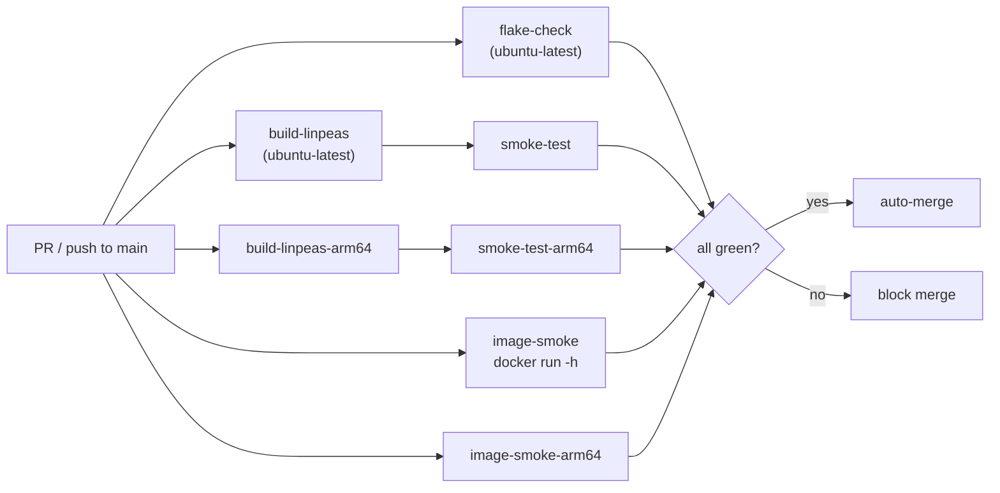

# CI architecture

Every push to `main` and every PR runs a required set of jobs that gate auto-merge. Separate non-blocking weekly workflows run informational checks (image CVE scans).

## Build and smoke gates

The seven functional gates below are the build-and-run core of the required
set; the full list of 29 required contexts is in the next section.



## Required check list

The canonical list — mirroring the `protect-main` branch ruleset — lives
in [`docs/security/required-checks.md`](../security/required-checks.md).
The tables below group all 29 required contexts by what they gate; consult
the canonical doc as source of truth.

Functional gates:

| Job                   | Runner             | What it tests                                                                                   |
| --------------------- | ------------------ | ----------------------------------------------------------------------------------------------- |
| `flake-check`         | `ubuntu-latest`    | `nix flake check` — eval, treefmt, deadnix, statix, actionlint, yamllint, shellcheck            |
| `build-linpeas`       | `ubuntu-latest`    | `nix build .#linpeas` — fetches upstream `linpeas.sh`, verifies SRI hash, builds the derivation |
| `smoke-test`          | `ubuntu-latest`    | `./result/bin/linpeas -h` exits 0                                                               |
| `build-linpeas-arm64` | `ubuntu-24.04-arm` | aarch64 build of `linpeas`                                                                      |
| `smoke-test-arm64`    | `ubuntu-24.04-arm` | aarch64 `-h` smoke                                                                              |
| `image-smoke`         | `ubuntu-latest`    | builds OCI image, `docker load`, `docker run --rm  -h` exits 0                             |
| `image-smoke-arm64`   | `ubuntu-24.04-arm` | aarch64 OCI image smoke                                                                         |

Self-enforcing invariant gates:

| Job                          | What it enforces                                                                                                                                                                                                                                                                                                                         |
| ---------------------------- | ---------------------------------------------------------------------------------------------------------------------------------------------------------------------------------------------------------------------------------------------------------------------------------------------------------------------------------------- |
| `dashboard-data-tests`       | `scripts/gen-dashboard-data.sh` security guards (pin shape, asset-URL prefix, missing-field hard-fail)                                                                                                                                                                                                                                   |
| `pr-workflows-no-secrets`    | PR-triggered workflows reference no `secrets.*` other than `secrets.GITHUB_TOKEN`                                                                                                                                                                                                                                                        |
| `renovate-invariants`        | `renovate.json` keeps SHA-digest pinning, `minimumReleaseAge`, per-manager `automerge`, and `pinDigests: true` for `github-actions`                                                                                                                                                                                                      |
| `required-checks-no-paths`   | No required workflow declares `paths:` / `paths-ignore:` under `pull_request:`                                                                                                                                                                                                                                                           |
| `tag-protection-drift-check` | The `release-tag-protection` ruleset still blocks deletion / non-FF / update of release-tag refs                                                                                                                                                                                                                                         |
| `lint-workflow-security`     | Batched workflow-security member lints; e.g. member check `uses-sha-pinned`: every `uses:` in workflows + composite actions is a full 40-hex SHA (or a `./...` self-ref). The trailing `# vX.Y.Z` patch-tag comment is a separate rule, `patch-tag-pins`, enforced as a pre-commit hook only — it is in no lint group and gates no merge |
| `cliff-tag-pattern`          | `cliff.toml`'s `tag_pattern` still matches the canonical pin-shape regex, so git-cliff keeps seeing the release tags                                                                                                                                                                                                                     |
| `harness-group`              | Every fixture-driven test harness in the group runs, alongside the one live-repo probe wired to them (`ratchet-pin-audit`); the rest are test-only by design                                                                                                                                                                             |
| `lint-doc-invariants`        | Batched doc-invariant member lints (12), covering invariant-index integrity, doc anchors, ephemeral references, cron restatement, and schema validation                                                                                                                                                                                  |
| `lint-script-hygiene`        | Batched shell-hygiene member lints (17) over `scripts/` and `tests/`, covering shebang/pipefail, per-script test coverage, helper routing, and path hygiene                                                                                                                                                                              |
| `protect-main-drift-check`   | The live `protect-main` ruleset matches the desired posture, its in-tree mirror, and the required-contexts table in `docs/security/required-checks.md`                                                                                                                                                                                   |
| `setup-nix-required`         | Every workflow installing Nix goes through the `./.github/actions/setup-nix` composite with `github-token`, never a vendor installer directly                                                                                                                                                                                            |

Doc-quality + conventional-commit gates (all alphabetical):

| Job                                        | What it enforces                                                                                                                                            |
| ------------------------------------------ | ----------------------------------------------------------------------------------------------------------------------------------------------------------- |
| `changelog-links`                          | The regenerated changelog carries no duplicate PR links and keeps the scorecard-count preprocessor; released sections match a fresh git-cliff regeneration. |
| `commitlint`                               | Every branch commit independently satisfies [Conventional Commits](https://www.conventionalcommits.org).                                                    |
| `doc-freshness`                            | Every generated doc still matches what its generator emits.                                                                                                 |
| `editorconfig`                             | `.editorconfig` compliance (charset, line endings, trailing whitespace, final newline).                                                                     |
| `lint-pr-title` (workflow `pr-title-lint`) | PR title independently satisfies Conventional Commits and is spell-checked with `typos`. The PR title is used verbatim as the merge-commit subject.         |
| `markdownlint`                             | Markdown style + structure.                                                                                                                                 |
| `typos`                                    | Spell-check across the repo.                                                                                                                                |

Supply-chain + secret-scanning gates:

| Job                 | What it enforces                                                         |
| ------------------- | ------------------------------------------------------------------------ |
| `dependency-review` | Reviews the pull request's dependency changes for known vulnerabilities. |
| `gitleaks`          | Secret scan.                                                             |
| `trufflehog`        | Secret scan with a complementary detector set.                           |

## Merge policy

Merge-commit only. Enforced at both layers:

- **Repo:** `allow_merge_commit=true`, `allow_rebase_merge=false`, `allow_squash_merge=false`.
- **Ruleset:** `pull_request.allowed_merge_methods=["merge"]`.

`required_signatures` is enforced on the `protect-main` ruleset. Every commit on `main` (branch commit + merge commit) must carry a valid signature. Branch commits sign locally; bot commits originate from REST `PUT /contents` authenticated as the `linpeas-flake-bumper` GitHub App and are web-flow-signed by GitHub. See [Repository configuration](../security/repo-config.md) for the full posture.

## Non-blocking coverage / advisory checks

- `image-cve-scan.yml` (weekly cron + dispatch) runs Trivy and Grype against the released OCI image and uploads SARIF to code-scanning under distinct categories (`trivy-image-cve`, `grype-image-cve`) for cross-scanner DB coverage. Findings are CVE-DB-driven, not PR-driven, so the scheduled run against a fresh DB is the meaningful signal — and it fires even in weeks with no PR activity. Both scanners advisory only (job-level failure is `count > 0` of CRITICAL CVEs; SARIF upload always runs); failures auto-file deduped issues split by finding-vs-infrastructure label; the prevention path is a nixpkgs bump via `update-flake-lock`.
- `docs-audit-reminder.yml` (monthly cron + dispatch) opens a deduped `docs-audit` issue when CI-structure churn suggests hand-written CI prose has drifted. Advisory by construction: freshness gates cover only generated blocks, and the semantic claims they miss need a reading agent rather than a lint. Non-zero drift pressure never fails the job — a workflow that reddens during normal CI churn trains the maintainer to ignore red — but a genuine failure, such as the pressure script erroring or a GitHub API call failing, does go red, because that is a real problem rather than a drift signal. The issue only closes when drift pressure returns to zero, not because an audit ran, so after running `/docs-audit` the maintainer should close it manually; a fresh issue opens the following month if pressure is non-zero again.
- `octoscan.yml`'s PR trigger is paths-filtered to the files it reads (`.github/workflows/**` plus `scripts/octoscan-scan.sh`; composite actions under `.github/actions/` are not scan targets). `codeql.yml` deliberately runs on **every** PR with no paths filter, so the OpenSSF Scorecard SAST check keeps scoring the fraction of merged PRs that ran a SAST tool above threshold. Both stay outside the required set — `required-checks-no-paths` forbids paths filters on required workflows.

The full layered model — which scanner runs when, and why the overlap is a
budgeted defense-in-depth posture rather than redundancy — is documented in
[workflow-scanner division of labor](../security/workflow-scanners.md).

## Runner egress

Every job's first step is `step-security/harden-runner` with `egress-policy: block` and a per-job `allowed-endpoints:` allowlist. The eBPF monitor enforces the allowlist and must remain the first step in any job that hits the network or filesystem. A missed host appears as a blocked-egress failure and is fixed forward by extending that job's allowlist.

## Pages workflow

The Pages workflow (`pages.yml`) is **not** in the required set. Its `build` job runs on every PR for visibility; on non-PR events a `build` or `deploy` failure auto-files a deduped issue tagged `pages-build-failure`. The `notify` job is skipped on `pull_request`, so a failure on a contributor branch files nothing. Coupling the Pages build to merge-gating would invert the priority — the supply-chain pipeline is higher priority than the documentation site.

```mermaid
flowchart TD
  trigger["pages.yml<br/>push to main /<br/>PR / release / cron / dispatch"]
  data["bash scripts/gen-dashboard-data.sh"]
  build["nix build 'path:$(pwd)#site'<br/>(path: ref — git ref hides the<br/>gitignored dashboard.yml)"]
  smoke["smoke: index.html exists<br/>+ no raw {{ }} in dashboard/index.html"]
  isPR{"event == pull_request?"}
  deploy["actions/deploy-pages<br/>OIDC, github-pages env"]
  pr_only["build only"]
  notifygate{"event == pull_request?"}
  fail["create / comment<br/>deduped issue"]
  quiet["no issue filed"]

  trigger --> data --> build --> smoke --> isPR
  isPR -- yes --> pr_only
  isPR -- no --> deploy
  build -. failure .-> notifygate
  smoke -. failure .-> notifygate
  deploy -. failure .-> notifygate
  notifygate -- yes --> quiet
  notifygate -- no --> fail
```

## Cache

Nix-based jobs pull from the public `cache.nixos.org` substituter; there is no repo-specific Nix binary cache layered on top. All third-party actions are SHA-pinned, with `# vX.Y.Z` patch-tag comments except for refs carrying an inline `# patch-tag-exception:` marker — see [pin convention](pin-convention.md). Renovate maintains them via `helpers:pinGitHubActionDigests` + explicit `pinDigests: true` in `renovate.json`.

## Cron schedule

All schedules fit the maintainer's monitoring windows: daily crons run 08:00–10:00 UTC, weekly crons run Friday 05:00–07:00 UTC (both year-round inside the intended US-Eastern early-morning windows regardless of DST). Two schedules sit outside those windows. `ci-watchdog` is a backstop that must fire around the clock, not a monitoring-window report, so it runs on a continuous 30-minute cadence instead. The monthly `docs-audit-reminder` sits at 10:00 on the 1st, at the tail of the daily window and clear of every daily cron in it, so a once-a-month reminder never competes with the bump pipeline for attention.

| Workflow                          | Cron            | UTC          | Purpose                                                                                                                    |
| --------------------------------- | --------------- | ------------ | -------------------------------------------------------------------------------------------------------------------------- |
| `ci-watchdog`                     | `20,50 * * * *` | every 30 min | Re-run failed jobs on stuck auto-merge bot PRs, bounded to 3 attempts                                                      |
| `actions-cache-prune`             | `0 8 * * *`     | 08:00 daily  | Evict stale `actions/cache` entries to stay under repo quota                                                               |
| `update-linpeas`                  | `5 8 * * *`     | 08:05 daily  | Check upstream peass-ng for new release; open auto-merge bump PR                                                           |
| `stale-pin-check`                 | `0 9 * * *`     | 09:00 daily  | Auto-file issue if pin is N days behind upstream                                                                           |
| `ratchet-pin-audit`               | `15 9 * * *`    | 09:15 daily  | Audit third-party action pins are SHA-pinned + Renovate-tracked                                                            |
| `settings-posture-drift-check`    | `25 9 * * *`    | 09:25 daily  | Diff live repo settings vs committed baseline                                                                              |
| `allowed-actions-api-drift-check` | `35 9 * * *`    | 09:35 daily  | Diff live Actions allowlist vs committed baseline                                                                          |
| `pages`                           | `55 9 * * *`    | 09:55 daily  | Rebuild dashboard from current pin + upstream + release JSON                                                               |
| `update-flake-lock`               | `0 5 * * 5`     | Fri 05:00    | Refresh `flake.lock` via auto-merge PR                                                                                     |
| `reproducibility-check`           | `10 5 * * 5`    | Fri 05:10    | Rebuild flake outputs twice; fail on hash divergence                                                                       |
| `image-cve-scan`                  | `30 5 * * 5`    | Fri 05:30    | Trivy + Grype CVE scan of the OCI image; SARIF to code-scanning                                                            |
| `verify-latest-release`           | `40 5 * * 5`    | Fri 05:40    | Re-fetch published artifacts; verify SRI hash + attestations                                                               |
| `links`                           | `50 5 * * 5`    | Fri 05:50    | Markdown link checker (lychee); cron-only, not a required check                                                            |
| `codeql`                          | `0 6 * * 5`     | Fri 06:00    | CodeQL static analysis (Actions)                                                                                           |
| `octoscan`                        | `10 6 * * 5`    | Fri 06:10    | Octoscan SAST on `.github/workflows/*.yml`                                                                                 |
| `scorecard-drift-check`           | `20 6 * * 5`    | Fri 06:20    | Diff OSSF Scorecard live results vs committed baseline                                                                     |
| `zizmor-drift-check`              | `30 6 * * 5`    | Fri 06:30    | Diff live zizmor results vs committed baseline                                                                             |
| `gitleaks`                        | `40 6 * * 5`    | Fri 06:40    | Full-history secret scan                                                                                                   |
| `trufflehog`                      | `50 6 * * 5`    | Fri 06:50    | Full-history secret scan (complementary detector set)                                                                      |
| `docs-audit-reminder`             | `0 10 1 * *`    | 1st 10:00    | Monthly prompt to run the semantic docs audit; opens a deduped `docs-audit` issue when CI churn suggests prose has drifted |

Daily crons fire in this UTC order: `ci-watchdog` (00:20) → `actions-cache-prune` (08:00) → `update-linpeas` (08:05) → `stale-pin-check` (09:00) → `ratchet-pin-audit` (09:15) → `settings-posture-drift-check` (09:25) → `allowed-actions-api-drift-check` (09:35) → `pages` (09:55). `ci-watchdog`'s minute field (`20,50`) recurs every 30 minutes around the clock — the 00:20 timestamp is only where its cron string sorts among the fixed-time daily crons, not a single daily firing. Bump-related crons (`update-linpeas`, `stale-pin-check`) front-load the window so the dashboard cron at 09:55 reads a settled state; drift checks cluster between them. Weekly crons fire Friday in slot order: `update-flake-lock` leads at 05:00 so its auto-merge PR's CI runs inside the window, the build- and release-verification chain (`reproducibility-check` → `image-cve-scan` → `verify-latest-release` → `links`) fills out the first hour, the scanner cluster (`codeql` → `octoscan` → `scorecard-drift-check` → `zizmor-drift-check`) fills the second, and the secret-scan pair (`gitleaks`, `trufflehog`) closes it.

### Pages staleness window

On bump days, the 08:05 `update-linpeas` run opens a PR; required checks plus auto-merge typically complete within an hour, after which `release-on-bump.yml` cuts the GitHub release. The 09:55 `pages` cron then reads the freshly-bumped `linpeas-pin.json` from `main` plus the just-published release JSON and renders a consistent dashboard. The ~1h50m slack between bump start and dashboard render is an accepted tradeoff for keeping every daily cron inside the maintainer's monitoring window — the typical bump pipeline finishes well inside it.

If the bump pipeline is delayed past 09:55 (rare — CI queue surge, Renovate auto-merge held by a required check), the daily cron reads the previous day's pin and publishes a dashboard claiming `drift.days = 1`. This is **by-design** tolerable:

- `pages.yml` also runs on `push: branches: [main]` and `release: published`, so the dashboard is re-rendered within minutes of any bump merge.
- The dashboard page and `security/trust-model.md` self-describe as documentation, not a trust anchor. Authoritative signal lives in `gh attestation verify` against the published artifacts, not the dashboard text.

Surfacing "open bump PR" state on the dashboard is deliberately not implemented — it would couple a documentation surface to PR metadata without changing the underlying trust model.

## Stale-pin failure attribution

`stale-pin-check.yml`'s notify body distinguishes:

- `reason=pin-malformed` — local `linpeas-pin.json` has a malformed
    `.version` field.
- `reason=upstream-api-failure` — `gh api .../releases/latest` failed or
    returned empty.
- `reason=upstream-tag-malformed` — the API succeeded but upstream
    published a tag outside the canonical shape.
- `reason=stall-detected` — API succeeded but local pin is stale.

Do not collapse into single `failure` classification.

## Cron-notify root-cause comments

When a `notify-workflow-result` issue auto-closes after a transient
failure recovers, leave a one-line root-cause comment on the closed
issue (e.g. `transient: docker.io 502`, `transient: cache.nixos.org 5xx`). The issue itself is closed; the comment is the durable
record. Future failures of the same shape get triaged faster, and
the closed-issue history doubles as a frequency log.

This is a maintainer-discipline invariant, not a code invariant — no
lint enforces it.

## dockerhub-sync trigger

Triggers: `workflow_run` of `release-on-bump` completed-successfully + manual
`workflow_dispatch`.

```yaml
if: github.event_name == 'workflow_dispatch' || github.event.workflow_run.conclusion == 'success'
```

- Do NOT reintroduce `push:` trigger.
- Keep the `if:` gate on the `sync` job.
- `notify` job uses `if: always()` and reads `needs.sync.result`; skipped =
    inert in `notify-workflow-result`, cancelled = filed as an
    infrastructure failure.

## GitHub Pages site invariants

- `docs/_data/dashboard.yml` is generated by `scripts/gen-dashboard-data.sh`
    at site-build time and `.gitignore`d. Committing is a review-blocker.

- `scripts/gen-dashboard-data.sh` enforces (mirrors `bump-linpeas.sh`):

    1. `pin.version` must match `[0-9]{8}-[0-9a-f]{7,40}` — hard-fail.
    1. `pin.url` must start with
        `https://github.com/peass-ng/PEASS-ng/releases/download/` — hard-fail.
        The rendered dashboard links that URL, so an off-prefix pin would
        point a reader at a download host upstream does not control.
    1. Missing required JSON fields hard-fail with field name; never partial
        YAML.
    1. This-repo lookups that are allowed to degrade (`releases/latest`, the
        last-bump PR search, the latest `verify-latest-release` run) are
        shape-checked before use. `gh api` writes its JSON error body to
        stdout, so an unchecked error body would publish its missing keys as
        a literal `"null"` tag or image ref. A failed, unparsable, or
        wrong-shaped response degrades to the documented empty/`unknown`
        section and logs a `WARN` naming the lookup.
    1. The YAML is written atomically — `make_temp` then `mv`, never a `>`
        redirect onto the final path — so an aborted run cannot leave a
        truncated `dashboard.yml` behind for the site build to read.

    Tested by `tests/gen-dashboard-data.test.sh` via `dashboard-data-tests`
    required CI job. The script's eight fixture-injection env hooks are
    `PIN_FILE_OVERRIDE`, `OUT_FILE_OVERRIDE`,
    `UPSTREAM_RELEASE_JSON_OVERRIDE`, `LATEST_RELEASE_JSON_OVERRIDE`,
    `THIS_REPO_RELEASES_JSON_OVERRIDE`, `UPSTREAM_RELEASES_JSON_OVERRIDE`,
    `BUMP_PR_JSON_OVERRIDE`, and `PARITY_JSON_OVERRIDE`. New invariant in
    script requires matching fixture + scenario.

- `pages.yml`'s `build` job intentionally NOT in required-check set. Site bug
    must not block pin bumps.

- `pages.yml` uses only `secrets.GITHUB_TOKEN`. New secret requires
    security-review entry documenting scope + rotation.
