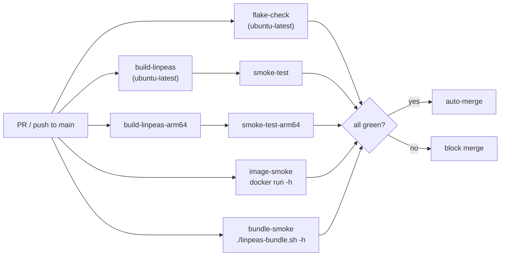

# CI architecture

Every push to `main` and every PR runs a required set of jobs that gate auto-merge. A separate non-blocking coverage matrix runs informational checks.

## Required jobs



## Required check list

| Job | Runner | What it tests |
|-----|--------|---------------|
| `flake-check` | `ubuntu-latest` | `nix flake check` — eval, treefmt, deadnix, statix, actionlint, yamllint, shellcheck, README-staleness, schema |
| `build-linpeas` | `ubuntu-latest` | `nix build .#linpeas` — fetches upstream `linpeas.sh`, verifies SRI hash, builds the derivation |
| `smoke-test` | `ubuntu-latest` | `./result/bin/linpeas -h` exits 0 |
| `build-linpeas-arm64` | `ubuntu-24.04-arm` | aarch64 build of `linpeas` |
| `smoke-test-arm64` | `ubuntu-24.04-arm` | aarch64 `-h` smoke |
| `image-smoke` | `ubuntu-latest` | builds OCI image, `docker load`, `docker run --rm  -h` exits 0 |
| `bundle-smoke` | `ubuntu-latest` | builds bundle, `./result/linpeas-bundle.sh -h` exits 0 |

## Non-blocking coverage matrix

`flake-check` and `build-linpeas` also run across `ubuntu-latest` × `macos-latest` × stable-Nix × unstable-Nix. Failures surface in the PR view but do not gate merges.

## Pages workflow

The Pages workflow (`pages.yml`) is **not** in the required set. Its `build` job runs on every PR for visibility, and its failure auto-files a deduped issue tagged `pages-build-failure`. Coupling the Pages build to merge-gating would invert the priority — the supply-chain pipeline is higher priority than the documentation site.

```mermaid
flowchart TD
  trigger["pages.yml<br/>push to main /<br/>PR / release / cron / dispatch"]
  data["bash scripts/gen-dashboard-data.sh"]
  build["nix build .#site"]
  smoke["smoke: index.html exists<br/>+ no raw {{ }} in dashboard.html"]
  isPR{"event == pull_request?"}
  deploy["actions/deploy-pages<br/>OIDC, github-pages env"]
  pr_only["build only"]
  fail["on failure:<br/>create / comment deduped issue"]

  trigger --> data --> build --> smoke --> isPR
  isPR -- yes --> pr_only
  isPR -- no --> deploy
  build -. failure .-> fail
  smoke -. failure .-> fail
```

## Cache

All Nix-based jobs use `DeterminateSystems/flakehub-cache-action` (free for public repos). All third-party actions are SHA-pinned with `# vX` version comments; Renovate maintains them via `helpers:pinGitHubActionDigests` + explicit `pinDigests: true` in `renovate.json`.

## Cron schedule

| Workflow | Cron | UTC | Purpose |
|----------|------|-----|---------|
| `update-linpeas` | `0 9 * * *` | 09:00 daily | Check upstream peass-ng for new release; open auto-merge bump PR |
| `stale-pin-check` | `30 10 * * *` | 10:30 daily | Auto-file issue if pin is N days behind upstream |
| `verify-latest-release` | `0 12 * * *` | 12:00 daily | Re-fetch published artifacts; verify SRI hash + attestations |
| `pages` | `0 14 * * *` | 14:00 daily | Rebuild dashboard from current pin + upstream + release JSON |
| `codeql` | `0 8 * * 1` | Mon 08:00 | CodeQL static analysis (Actions) |
| `update-flake-lock` | `0 6 * * 5` | Fri 06:00 | Refresh `flake.lock` via auto-merge PR |

Daily crons fire morning→afternoon UTC in this order. Bump-related crons (`update-linpeas`, `stale-pin-check`, `verify-latest-release`) front-load the day so the dashboard cron at 14:00 reads a settled state.

### Pages staleness window

On bump days, the 09:00 `update-linpeas` run opens a PR; required checks plus auto-merge typically complete within an hour, after which `release-on-bump.yml` cuts the GitHub release. The 14:00 `pages` cron then reads the freshly-bumped `linpeas-pin.json` from `main` plus the just-published release JSON and renders a consistent dashboard.

If the bump pipeline is delayed past 14:00 (rare — CI queue surge, flakehub-cache cold-start, Renovate auto-merge held by a required check), the daily cron reads the previous day's pin and publishes a dashboard claiming `drift.days = 1`. This is **by-design** tolerable:

- `pages.yml` also runs on `push: branches: [main]` and `release: published`, so the dashboard is re-rendered within minutes of any bump merge.
- The dashboard page and `security/trust-model.md` self-describe as documentation, not a trust anchor. Authoritative signal lives in `gh attestation verify` against the published artifacts, not the dashboard text.

Surfacing "open bump PR" state on the dashboard (audit NX-PD-3 option 1) is deliberately not implemented — it would couple a documentation surface to PR metadata without changing the underlying trust model.
