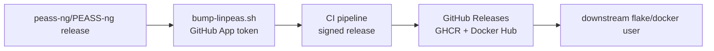

# Threat model

## Purpose

This page sketches the trust boundaries the project crosses and the
controls that defend each boundary. It is a posture overview for new
contributors and security reviewers — not a binding invariant. The
canonical wording for each control lives in the linked `docs/security/`
file; this page exists so a reader can locate the right control without
reconstructing the model from the invariant index.

## Trust boundaries

## Per-boundary threats and mitigations

### upstream → bot

**Threats:** tampered upstream release asset, MITM during download,
upstream account compromise post-release.

**Mitigations:**

- SRI digest pin in `linpeas-pin.json`, written by
    `scripts/bump-linpeas.sh` only.
- GitHub-API `.digest` cross-checked against the downloaded asset at bump
    time — hard fail when it is absent, unprefixed, or mismatched. The
    recorded SRI `hash` is that digest: the two encode the same 32 bytes,
    so the pin carries no separate digest field and needs none.
- URL-prefix lock to `https://github.com/peass-ng/PEASS-ng/releases/download/`.

See [`docs/security/verification.md`](verification.md).

### bot → ci

**Threats:** malicious workflow injection, untrusted action code
execution, secret exfiltration from third-party actions.

**Mitigations:**

- Every `uses:` is pinned to a full 40-hex SHA (not a tag) or is a path-relative `./` self-reference.
- `uses:` vendors are restricted by the repo Actions allowlist
    (`allowed_actions: selected`).
- Top-level `permissions: {}`; every job declares an explicit
    least-privilege `GITHUB_TOKEN` scope block.
- `harden-runner` is the first step in every job.
- PR-triggered workflows expose only `secrets.GITHUB_TOKEN`.

See [`docs/security/repo-config.md`](repo-config.md),
[`docs/security/allowed-actions.md`](allowed-actions.md),
and [`docs/security/trust-model.md`](trust-model.md).

### ci → art

**Threats:** artifact substitution, unauthorized release tag, commit
forgery on `main`.

**Mitigations:**

- Tag-protection ruleset (`release-tag-protection`) blocks deletion,
    non-fast-forward update, and arbitrary update of release-tag refs,
    with no bypass actors — release tags are immutable once minted, but
    minting one is not itself a restricted operation; drift-check lint
    asserts the ruleset is intact and that its bypass-actor list is
    empty.
- Releases are web-flow signed; no PAT, no `git push` from the bot.
- `protect-main` ruleset enforces required checks and signed commits.

See [`docs/security/repo-config.md`](repo-config.md)
and [`docs/security/trust-model.md`](trust-model.md).

### art → consumer

**Threats:** stale or compromised container image, manifest tampering
between registry and pull, supply-chain vulnerability in a transitive
dependency.

**Mitigations:**

- Multi-arch manifests are created with `buildx imagetools create` using
    `@sha256:` digest references — no tag-only manifests.
- SBOM generation and attestation run on every release that publishes
    images (`release-on-bump.yml`, `image-mode: full`); an image-less
    backfill release carries the pin-file attestation and sidecar only.
- Trivy and Grype CVE scans run on a weekly cron, a path-filtered push
    to `main`, and manual dispatch (`image-cve-scan.yml`). They are
    advisory only: neither is in the required-check set. Each fails its
    own job on CRITICAL findings and opens a deduped tracking issue.
- Docker Hub push credentials are split into `_RW` and `_DELETE` tokens,
    never an unsuffixed PAT.

See [`docs/security/verification.md`](verification.md)
and [`docs/install/docker.md`](../install/docker.md).

## Out of scope

- Runtime LinPEAS behavior on the target system (this project ships
    the binary; what it does is upstream's design).
- Upstream PEASS-ng compromise prior to release publication (we pin
    what they publish; their internal release pipeline is outside our
    trust boundary).
- The downstream consumer's Nix store, Docker daemon, or host integrity.
