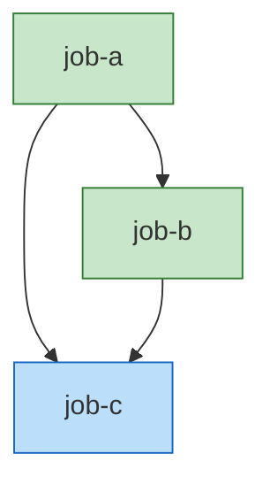

<!-- BEGIN ci-dag -->

```mermaid
flowchart TD
  classDef build fill:#c8e6c9,stroke:#2e7d32
  classDef security fill:#ffe0b2,stroke:#e65100
  classDef doc fill:#bbdefb,stroke:#1565c0
  classDef commits fill:#e1bee7,stroke:#6a1b9a
  classDef aux fill:#eeeeee,stroke:#616161

  job-a:::build
  job-b:::build
  job-c:::doc

  job-a --> job-b
  job-a --> job-c
  job-b --> job-c
```

<!-- END ci-dag -->
